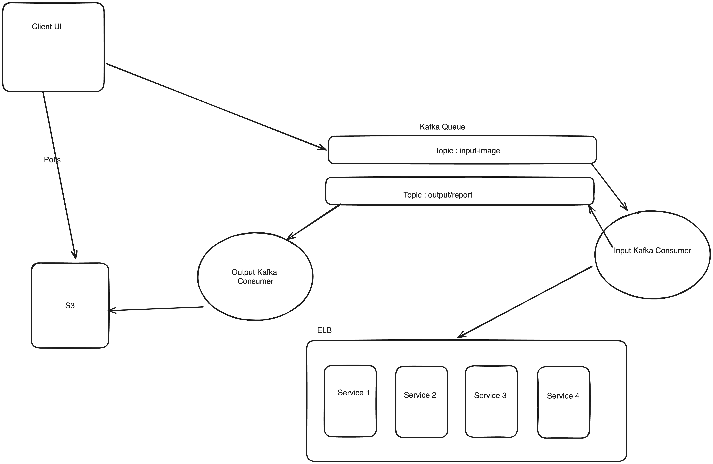

# What ? Automate Palm Reading 

## North Starts 
- Horinzontally Scalable Backend, using K8s for now !
- A message queue with broker support for /process APIs. 
- Optimising on the palm reading, using GPTs to figure out rules <WIP>
- Front-end with NextJs, support for dominant image scanning <Starting with Right for now>

## Tech Stack 
- Python <Open CV> for all things image processing
- Python <Fast API> for all things resource. 
- Kafka for message delivery <A single kafka topic> 
- Kafka consumers <N backend services> reading for the same kafka topic and putting results in <A single 
kafka topic>
- A consumer taking report from the output kafka topic and putting into S3, and client uses S3 location to 
figure out if processing is done or not !

## HLD 

  
